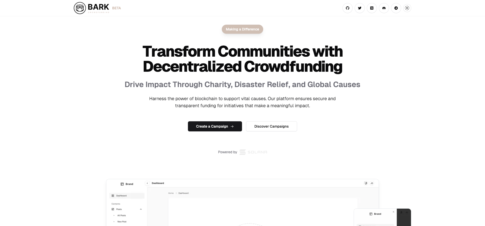

# BARK Protocol: Solana-Based Crowdfunding Platform Monorepo

**Prototype**

Welcome to the BARK Crowdfunding GitHub repository! This repository contains the codebase and documentation for our decentralized crowdfunding platform built on the Solana blockchain. BARK Protocol provides a secure, scalable, and user-friendly solution for fundraising, leveraging Solana’s high-performance capabilities.

## Overview

BARK | Crowdfunding dApp is designed to enhance the efficiency, security, and transparency of fundraising campaigns. It supports multi-currency contributions, integrates decentralized storage solutions, and employs advanced security measures.

### Key Features

- **User-Friendly Interface**: Built with React.js, Next.js, and Shadcn for a seamless experience.
- **Solana Blockchain Integration**: Utilizes Solana for fast, secure transactions.
- **Secure Donations**: Blockchain-based donations ensure transparency and immutability.
- **Automated Token Minting**: Fundraiser tokens are minted and distributed to donors.
- **Digital Fund Receipts**: Receipts are provided for all contributions.
- **Decentralized Storage**: Uses Arweave/IPFS for durable, censorship-resistant storage.
- **Programs (Smart Contracts)**: Anchor-based programs automate fundraising and enforce campaign rules.
- **Cross-Chain Functionality**: Integrates Chainlink and PYTH oracles for real-world data.
- **Wallet Integration**: Supports Solana-compatible wallets.
- **Solana Pay Integration**: Enables seamless payments via Solana Pay.
- **Payment Gateways**: BARK’s Web3 Payments Gateway supports donations and payments in BARK, SOL, and USDC, offering flexibility and convenience for contributors.

## Architecture

### Components

1. **Frontend (React.js)**:
   - Dynamic interfaces for campaign management and donations.
   - Integration with Solana Web3.js and Solana Pay API.

2. **Backend (Solana Blockchain)**:
   - Handles transactions and program execution.
   - Smart contracts in Solana’s native language.

3. **Decentralized Storage**:
   - **Arweave/IPFS**: For campaign metadata and media files.

4. **APIs and SDKs**:
   - **Solana Web3.js**: Facilitates frontend and blockchain interaction.
   - **Solana Pay API**: For secure payment processing.
   - Third-party APIs for identity verification and data aggregation.

5. **Payments Gateway**:
   - **Solana Pay**: @solana/pay is a JavaScript library for facilitating commerce on Solana using a token transfer URL scheme. The URL scheme ensures that payment requests are created and interpreted consistently across different wallets or services.
   - **BARK Web3 Payments Gateway**: Supports donations and payments in BARK, SOL, and USDC, offering flexibility and convenience.

6. **Payments Widget**:
   - **Integrated Widget**: Provides an embedded, user-friendly interface for making payments and donations directly within the platform, streamlining the donation process.

7. **Security Components**:
   - **Encryption**: End-to-end encryption for data security.
   - **Authentication**: Secure wallet-based methods.

8. **Oracles and External Integrations**:
   - **Chainlink**: Decentralized oracles for real-world data.
   - **PYTH**: High-fidelity financial market data.

9. **Governance**:
   - Community-driven mechanisms for protocol upgrades and policies.

10. **Monitoring and Analytics**:
    - Tools for tracking blockchain performance and user interactions.

### Architecture Diagram


## Use Cases

- **Charity Fundraising**: Non-profits can use BARK Protocol for transparent fundraising.
- **Project Funding**: Startups can raise funds with immediate token liquidity.
- **Community Initiatives**: Community projects benefit from automated and transparent fundraising.


## Getting Started

To get started with BARK Protocol, follow these steps:

### Prerequisites

- **Node.js**: Ensure Node.js and npm are installed.
- **Solana-Compatible Wallet**: For blockchain interactions.
- **Arweave/IPFS Access**: For decentralized storage.
- **Solana Pay Integration**: For payment processing.

### Environment Variables

Rename `env.local.example` to `env.local` and add the required variables:

```bash
NEXT_PUBLIC_MAINNET_PROGRAM_ID=
NEXT_PUBLIC_DEVNET_PROGRAM_ID=
NEXT_PUBLIC_SHYFT_IPFS_PROJECT_ID=
NEXT_PUBLIC_SHYFT_IPFS_PROJECT_SECRET=
NEXT_PUBLIC_SHYFT_API=
NEXT_PUBLIC_CLIENT_ID=
NEXT_PUBLIC_CLIENT_SECRET=
NEXT_PUBLIC_PROVIDER_URL=

PINATA_JWT=
ALCHEMY_SOLANA_MAINNET=
ALCHEMY_SOLANA_DEVNET=

NEXT_PUBLIC_REDIRECT_URL=http://localhost:3000/callback
NEXT_PUBLIC_OPENID_PROVIDER_URL=https://accounts.google.com/.well-known/openid-configuration
NEXT_PUBLIC_FULLNODE_URL=https://fullnode.testnet.solana:443
NEXT_PUBLIC_PACKAGE_ID=
```

## Programs

**Escrow Public Key**: 

### Running the App

Start the development server:

```bash
npm run dev
```

### Interacting with the Program

Navigate to the program directory:

```bash
cd contract
```

### Testing the Program

Run tests with:

```bash
anchor test
```

### Compiling the Program

Build the smart contract:

```bash
anchor build
```

### Deploying the Program

Deploy the smart contract:

```bash
anchor deploy
```

## Program ID

**Test Account**: 32Qg9Pybde94crQEU8GaoBbhsMtjm2uer3MJZKLDbvHe

### Solana Testnet Explorer

View the program on the Solana Testnet Explorer:

[Solana Testnet Explorer](https://solscan.io/testnet/32Qg9Pybde94crQEU8GaoBbhsMtjm2uer3MJZKLDbvHe)

## Contributing

We welcome contributions! Please refer to the [CONTRIBUTING.md](CONTRIBUTING.md) file for guidelines.

## License

This project is licensed under the MIT License - see the [LICENSE](LICENSE) file for details.

## Disclaimer

This repository is for informational purposes only and does not constitute financial, legal, or investment advice. Participants should seek professional guidance before engaging with the BARK Protocol platform.

### NEXT.js

This project uses [Next.js](https://nextjs.org/) and was bootstrapped with [`create-next-app`](https://github.com/vercel/next.js/tree/canary/packages/create-next-app).

## Getting Started with Next.js

Run the development server:

```bash
npm run dev
# or
yarn dev
# or
pnpm dev
# or
bun dev
```

Open [http://localhost:3000](http://localhost:3000) to see the result.

Edit `app/page.tsx` to start customizing your page. The page auto-updates as you edit.

This project uses [`next/font`](https://nextjs.org/docs/basic-features/font-optimization) for font optimization.

## Learn More

- [Next.js Documentation](https://nextjs.org/docs) - Learn about Next.js features and API.
- [Learn Next.js](https://nextjs.org/learn) - An interactive tutorial.
- [Solana Pay](https://www.npmjs.com/package/@solana/pay).

Check out [the Next.js GitHub repository](https://github.com/vercel/next.js/) - feedback and contributions are welcome!

## Deploy on Vercel

Deploy your Next.js app with [Vercel](https://vercel.com/new?utm_medium=default-template&filter=next.js&utm_source=create-next-app&utm_campaign=create-next-app-readme). Check out our [Next.js deployment documentation](https://nextjs.org/docs/deployment) for more details.